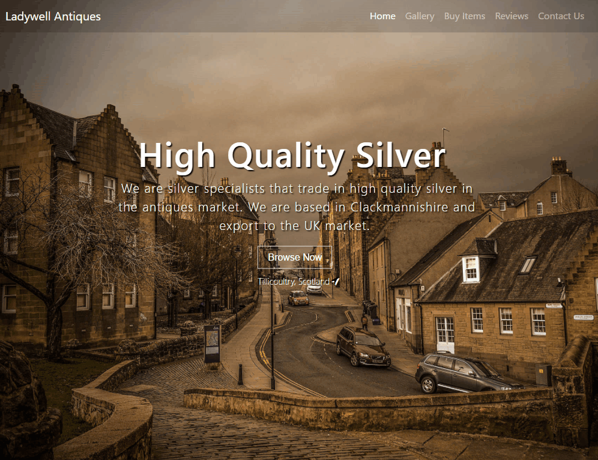

# Ladywell Antiques &nbsp;   

Ladywell antiques is a website and mobile app that is to be developed to showcase antique items available for acquisition before they go on auction. It is to be built with Angular and will allow the owner to upload and post various items available for sale. Said items will then be displayed on the website to potential buyers where they should be able to be purchased as well. This project will start in the middle of June 2017 and should be live by the start of August.

## Technologies

* Angular 2
* Bootstrap 4
* Amazon Web Services
    * Amazon DevPay
    * EC2
    * RDS
## License

Apache-2.0

